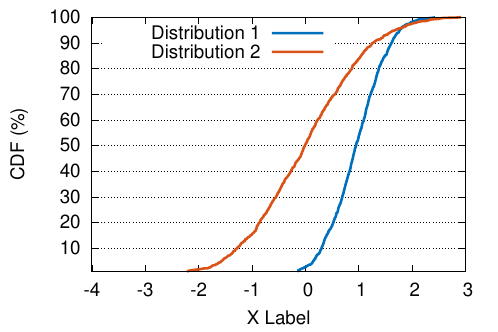
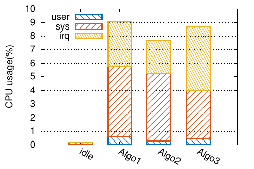
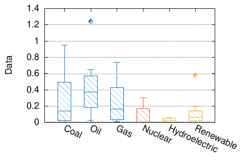

# Gnuplot scripts

Gnuplot 5.0+ is required to run these scripts.

Run the command below to generate all figures.

```
gnuplot plot.gp
```

This repository also provides the following utilities:

- `make_all_gp.sh`: find all `.gp` files under current working directory and run `gnuplot <filename>` with working directory of the `.gp` file.



