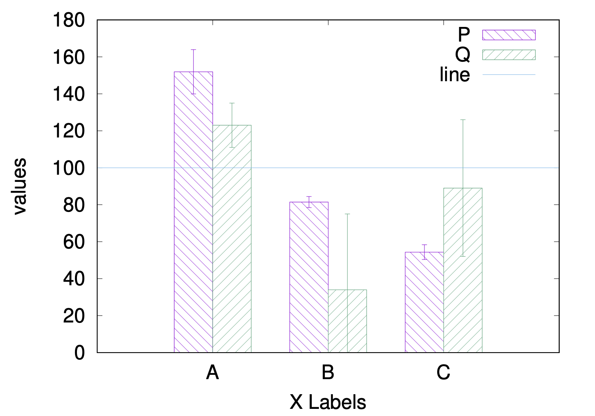
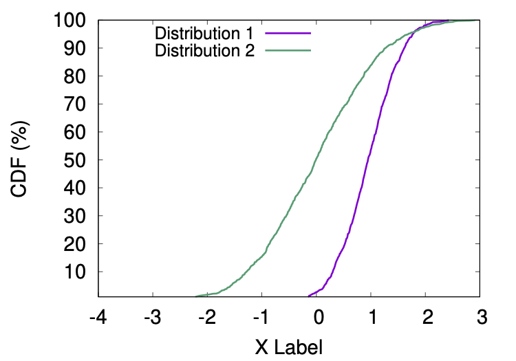
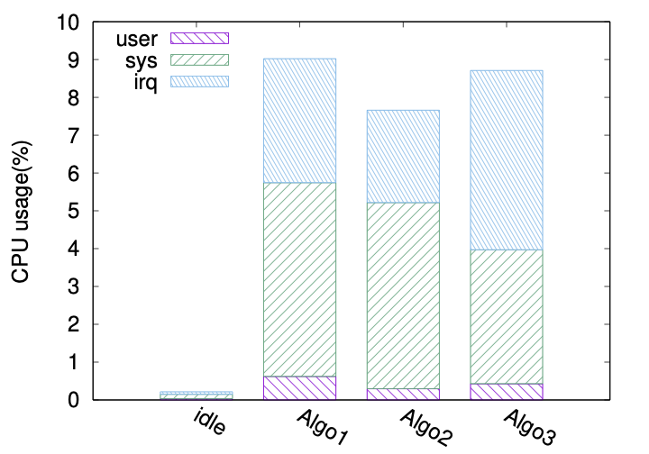

# Gnuplot scripts

Gnuplot 5.0+ is required to run these scripts.

## Histogram



```
inputfile = "histogram.txt"
```

## CDF



```
N=2
array datafiles[N] = ["normal.txt", "normal2.txt"]
array titles[N] = ["Distribution 1", "Distribution 2"]
```

It doesn't need to sort the data files.

## Stacked bar



```
inputfile = "stack.txt"
```
